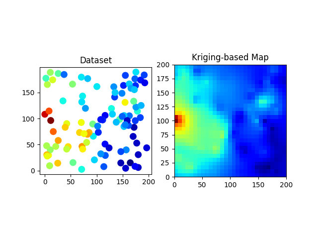

# Requirements
- Python 3.7.3
- numpy 1.16.2
- matplotlib 3.0.3

# Overview
* This code tries to construct a radio map via Regression Kriging (or Universal Kriging).
  * Path loss is estimated via ordinary least squares (OLS).
  * Shadowing is estimated via ordinary Kriging.
* Measurement samples consists of path loss and spatially-correlated log-normal shadowing.
* Spatial correlation follows an exponential decay model.

# License

The MIT License (MIT)

Copyright (c) 2020 Koya SATO.