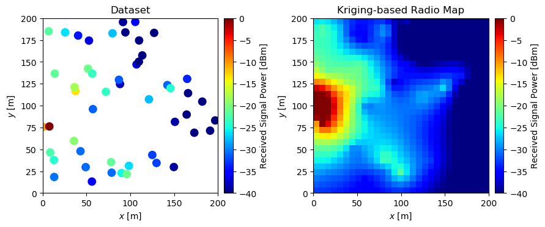

# Requirements
- Python 3.x
- numpy
- scipy
- matplotlib

# Overview
* This code tries to construct a radio map via Regression Kriging.
  * Path loss is estimated via ordinary least squares (OLS).
  * Shadowing is estimated via ordinary Kriging.
  * Note: this method is equal to universal Kriging.
* Measurement samples consist of path loss and spatially-correlated log-normal shadowing.
* Spatial correlation follows an exponential decay model.


# How To Use
You can run it with
```bash
$python kriging.py
```
If docker is available, you can alse use it via the following commands:
```bash
$docker build -t mypy .
$docker run -it --rm -v "$PWD":/usr/src/myapp -w /usr/src/myapp mypy:latest python3 kriging.py
```
("mypy" can be replaced with your favorite tag name)

# References

[1] N. Cressie, *Statistics for Spatial Data*. Hoboken, NJ, USA: Wiley, 1993.

[2] K. Sato, K. Inage, and T. Fujii, "On the Performance of Neural Network Residual Kriging in Radio Environment Mapping, " *IEEE Access*, vol. 7, no. 1, pp.94557-94568, 2019.


# License

The MIT License (MIT)

Copyright (c) 2021 Koya SATO.
